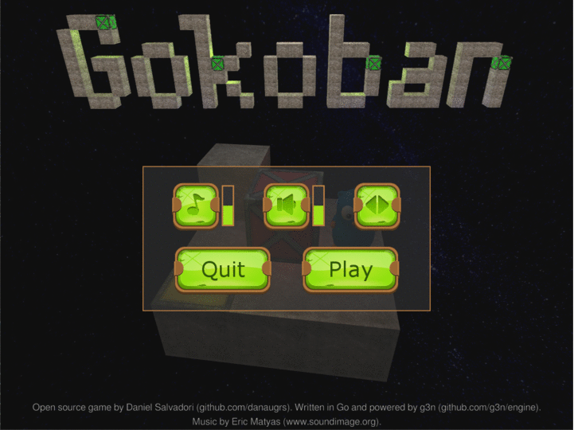

# Gokoban - 3D Puzzle Game

Gokoban is a 3D puzzle game written in Go. You control the Go gopher, and your objective in each level is to push the boxes until they are all on top of the yellow pads. There are elevators that help you reach high places and move boxes up and down. Levels are read from text files in [`/levels`](levels) so you can easily modify them and even create new ones.

It was created using [G3N](https://github.com/g3n/engine) for the [April-July 2017 Gopher Game Jam](https://itch.io/jam/gopher-jam) on [itch.io](https://itch.io).

#

  

